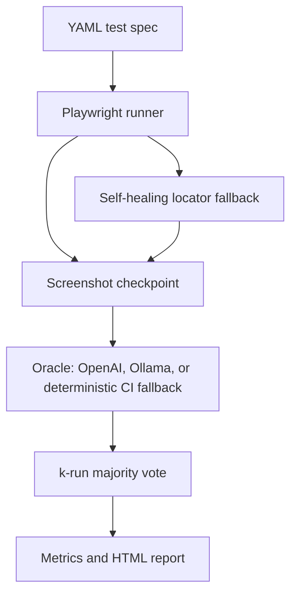

# Visual Test Oracle

Multimodal test-oracle prototype for GUI regression testing. The project uses a small checkout UI with controlled bug modes, Playwright execution, YAML test specs, screenshot checkpoints, k-run majority voting, and optional OpenAI/Ollama vision oracles.

## Research Question

Can a multimodal model judge whether a GUI screenshot satisfies a natural-language expected outcome, and can consistency voting plus self-healing locators make that judgment useful for regression testing?

## Architecture



## Quick Start

```powershell
python -m venv .venv
.\.venv\Scripts\Activate.ps1
pip install -r requirements.txt
python -m playwright install chromium
pytest
python scripts/run_evaluation.py --provider heuristic --k 3
python scripts/create_demo_gif.py
```

Open `docs/index.html` after the evaluation run.

## OpenAI and Ollama Runs

```powershell
$env:OPENAI_API_KEY="<your-openai-api-key>"
$env:OPENAI_MODEL="gpt-5.5"
python scripts/run_evaluation.py --provider openai --k 3

ollama pull qwen2.5vl:latest
python scripts/run_evaluation.py --provider heuristic --include-ollama --k 3
```

The GitHub Actions workflow intentionally uses the deterministic oracle so public CI has no API spend and no secret requirement.
This repository also includes `artifacts/ollama_bounded_evaluation.json`, a bounded local-model comparison produced with `qwen2.5vl:latest` and `k=1` on the local machine.

## Evaluation Metrics

- Bug detection rate over controlled UI mutants.
- False positive rate on clean app runs.
- Maintenance resilience under benign copy/selector changes.
- Agreement rate across k repeated oracle calls.
- Self-healing locator success count.
- Latency and estimated model cost hooks.

## Related Work

This prototype is positioned as a standalone engineering case study in GUI regression testing, test-oracle design, visual checking, locator resilience, and controlled evaluation of non-deterministic model behavior.

## Formal Case Study

- [Markdown case study](docs/case-study.md)
- [PDF case study](docs/case-study.pdf)

## Limitations

The committed report can be generated without OpenAI or Ollama for reproducibility. Model-backed evaluations should be treated as experimental runs and repeated because non-deterministic model behavior is itself part of the measurement.
